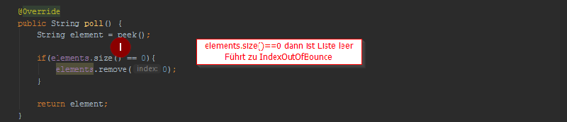

# Lab Report "Vertiefende Gesamtwiederholung Arbeitsaufträge"

<table>
    <tr>
        <td>
        Name
        </td>
        <td>
        Thomas Urlacher
        </td>
    </tr>
    <tr>
        <td>
        Abgabe
        </td>
        <td>
        04
        </td>
    </tr>
    <tr>
        <td>
        Repository
        </td>
        <td>
        <a href="https://github.com/urlacher/19-Abgabe04-Urlacher.git">https://github.com/urlacher/19-Abgabe04-Urlacher.git</a>
        </td>
    </tr>
</table>

---

# Inhalt

<!-- @import "[TOC]" {cmd="toc" depthFrom=2 depthTo=6 orderedList=false} -->

<!-- code_chunk_output -->

* [Aufgabenstellung](#aufgabenstellung)
* [Vorgehen](#vorgehen)
	* [1. TODO Liste mittels Markdown erstellen](#1-todo-liste-mittels-markdown-erstellen)
	* [2. BugFixing](#2-bugfixing)
		* [2.1 StringQueue Construktor Fehler](#21-stringqueue-construktor-fehler)
		* [2.2 poll() - IndexOutOfBounce Error](#22-poll-indexoutofbounce-error)
		* [2.3 remove() - unnötige Wert-Zuweisung](#23-remove-unnötige-wert-zuweisung)
	* [3. JavaDoc](#3-javadoc)
		* [3.1 JavaDoc Annotationen](#31-javadoc-annotationen)
		* [3.2 Allgemein](#32-allgemein)
		* [3.3 Implementierung ins Projekt](#33-implementierung-ins-projekt)
			* [3.3.1 main Page](#331-main-page)
			* [3.3.2 Interface Page](#332-interface-page)
			* [3.3.3 Implementation Page](#333-implementation-page)
	* [4. JUnit](#4-junit)
		* [4.1 Before, BeforeClasses etc](#41-before-beforeclasses-etc)
		* [4.2 Implementierte Tests](#42-implementierte-tests)
	* [5. pom.xml - JavaDoc](#5-pomxml-javadoc)
		* [5.1 Anpassungen pom.xml](#51-anpassungen-pomxml)
			* [5.1.1 Enticklerinformationen](#511-enticklerinformationen)
		* [5.1.2 SCM Informationen für die Maven-Site](#512-scm-informationen-für-die-maven-site)
		* [5.1.3 log4j Einbindung](#513-log4j-einbindung)
	* [6. Log4j](#6-log4j)
		* [6.1 Allgemeine Informationen](#61-allgemeine-informationen)
		* [6.2 Test Logging im Maven Lifecycle (Test)](#62-test-logging-im-maven-lifecycle-test)
	* [7. Maven Site Dokumentation](#7-maven-site-dokumentation)
		* [7.1 Allgemeine Infos](#71-allgemeine-infos)
		* [7.2 pom.xml - project-info-reports](#72-pomxml-project-info-reports)
		* [7.3 pom.xml - Maven Project Reports](#73-pomxml-maven-project-reports)
		* [7.4 site.xml - Zusätzliche Einstellungen](#74-sitexml-zusätzliche-einstellungen)
		* [7.5 Maven-Site Einbindung](#75-maven-site-einbindung)
	* [8. MarkDown Lab Report](#8-markdown-lab-report)
		* [8.1 Github Markdown Flavour](#81-github-markdown-flavour)
			* [8.1.1 Python Flavour](#811-python-flavour)
			* [8.1.2 Java Flavour](#812-java-flavour)

<!-- /code_chunk_output -->

---

## Aufgabenstellung

In dieser abschließenden Übung müssen Sie alle gelernten Aspekte des Konfigurationsmanagements im Rahmen des Queue Beispiels (Test Automation GitHub) wiederholen bzw. vertiefen.
Die Dokumentation müssen Sie komplett in Markdown erstellen und einen PDF Export davon abgeben. Während der Umsetzung müssen Teilergebnisse auf Ihr Repository online gestellt werden und eine eigene Taskliste geführt werden, damit für alle der aktuelle Status erkennbar ist.
Die Taskliste ist eine Github Flavor Erweiterung von Markdown, die Sie in Ihrer readme.md erstellen sollen. (Der Rest der Angabe ist die Basis Ihrer Arbeitsaufträge und zugleich Ausgangstaskliste– die dann entsprechen abhaken bzw. durch neue Punkte oder Subpunkte erweitern.)

---

## Vorgehen

### 1. TODO Liste mittels Markdown erstellen

* [x] 1. Übertrage Angabe in Taskliste in Mardown Readme
* [x] Einspielen Queue Vorlage aus Repository: <https://github.com/michaelulm/software-configuration-management/tree/master/test-automation/Queue>
* [x] Taskergebnisse Schritt für Schritt auf Git stellen
  * [x] Führung Taskliste
  * [x] Veröffentlichung in Git mit aktuell durchgeführten Tätigkeiten, z.B. Testfälle geschrieben so wird auch in der Taskliste diese Aufgabe als erledigt markiert und Testfälle inkl. geänderter Taskliste ins Repository übertragen.

---

* [x] 2. Korrigieren Sie den Code bzw. Debuggen Sie ihn um die Fehler zu finden
  * [x] Es befinden sich gesamt 3 Fehler im Source Code.
  * [x] Bei Bedarf optimieren Sie das Queue Beispiel.
  * [x] Ergänzen Sie das Beispiel nach eigenem Ermessen um es testen zu können.

---

* [x] 3. Erstellen Sie für Klasse und alle Methoden Kommentare um mittels Javadoc eine API Dokumentation zu erzeugen
  * [x] Integrieren Sie ein Bild (der generierten Dokumentation) in Ihren Report.

---

* [x] 4. Erstellung JUnit Tests (vollständig testen, mehrere Varianten)
  * [x] Sie werden die „selben“ Testfälle mehrfach erstellen müssen um „mehrere Variationen“ für einen möglichst vollständigen Test zu erreichen. Achten Sie dabei mit unterschiedlichen Daten zu testen.
  * [x] JavaDoc Kommentare erstellen.
  * [x] Integrieren Sie ein Bild (der generierten Dokumentation) in Ihren Report.

---

* [x] 5. Passen Sie Ihr pom.xml auf das Projekt an, damit Sie das Projekt erstellen aber auch Dokumentation generieren können.
  * [x] EntwicklerInnen Informationen hinzufügen.
  * [x] Integration Logging Bibliothek log4j mittels Maven Dependencies.

---

* [x] 6. Log4j (Version 2) integrieren und in jeder Methode ins Log schreiben
  * [x] Siehe aktualisiertes Stack Beispiel.
  * [x] Erstellen Sie einen Statischen Logger der auf die Konsole schreibt.
  * [x] Konfigurieren Sie Logger über ein properties File.
  * [x] Geben Sie eine Info Lognachricht bei Aufruf einer jeden Methode aus.
  * [x] Geben Sie eine Error Lognachricht aus bevor Sie einen Fehler werfen.
  * [x] Ergebnisse (Konsolenausgabe) als Bild in Dokumentation einfließen lassen.

---

* [x] 7. Maven Site Dokumentation erstellen
  * [x] Inklusive Javadoc Code und Javadoc Test Klassen
  * [x] Inklusive Menü mit Verweis auf manuell erstellte Seite
    * [x] Seite erläutert Funktionsweise Queue
    * [x] Geben Sie ein Bild der Maven Site Dokumentation in den Lab Report
    * [x] Der Inhalt der manuell erstellten Seite sollte ersichtlich sein

---

* [x] 8. Erstellung detaillierter und nachvollziehbarer Markdown Lab Report
  * [x] Übertragung Information aus Labreport Template.
  * [x] Alle Schritte dieser Übung nachvollziehbar erläutern.
  * [x] Übung Github Flavor: Erstellen Sie einen Codeblock im Dokument, welcher 3 Zeilen Python und 3 Zeilen Java Source Code korrekt darstellt.
  * [x] Korrekturlesen Dokumentation
  * [x] PDF erstellen (zB Dillinger)

---

* [x] 9. Überprüfung Vollständigkeit der Abgabe

---

* [x] 10. Abgabe PDF Version der Abgabe

---

### 2. BugFixing

Es wurden 3 Bugs im Java Projekt eingebaut.

#### 2.1 StringQueue Construktor Fehler

Die ersten beiden Fehler betreffen den Construktor.

1. Defaultwert erfordert eigenen Konstruktor
2. maxSize = maxSize ist nutzlos Wert wird nicht übernommen
3. ArrayList&lt;String&gt; könnte durch ArrayList&lt;&gt; ersetzt werden (Kein Bug in diesem Sinne)

**Bug**  


**Fix**  


#### 2.2 poll() - IndexOutOfBounce Error

1. Die Prüfung der ArrayListe auf die Size == 0 führt zu einer IndexOutOfBounce Exception.

**Bug**  


**Fix**  


#### 2.3 remove() - unnötige Wert-Zuweisung

1. Mit element = ""; wird dem Returnstring immer der Wert "" zugewiesen anstatt den ElementString zu retournieren

**Bug**  


**Fix**  


---

### 3. JavaDoc

#### 3.1 JavaDoc Annotationen

Folgende JavaDoc Annotationen könnten verwendet werden:

Tag und Parameter  | Ausgabe  | Verwendung in  | seit
-------------------|----------|----------------|-----
@author name  | Beschreibt den Autor.  | Klasse, Interface  |
@version version  | Erzeugt einen Versionseintrag. Maximal einmal pro Klasse oder Interface.  | Klasse, Interface  |
@since jdk-version  | Seit wann die Funktionalität existiert.  | Klasse, Interface, Instanzvariable, Methode  |
@see reference  | Erzeugt einen Link auf ein anderes Element der Dokumentation.  | Klasse, Interface, Instanzvariable, Methode  |
@serial  | Beschreibt die serialisierten Daten eines Serializable-Objekts.  | Klasse  |
@serialField  | Dokumentiert ein Feld eines Serializable-Objekts.  | Klasse, Methode  |
@param name description  | Parameterbeschreibung einer Methode.  | Methode  |
@return description  | Beschreibung des Rückgabewerts einer Methode.  | Methode  |
@throws, @exception classname description  | Beschreibung einer Exception, die von dieser Methode geworfen werden kann.  | Methode  |
@deprecated description  | Beschreibt eine veraltete Methode, die nicht mehr verwendet werden sollte. Sollte ab Java 5.0 immer mit der @Deprecated-Annotation verwendet werden.  | Methode  |
{@inheritDoc}  | Kopiert die Beschreibung aus der überschriebenen Methode.  | Überschreibende Methode  | 1.4.0
{@link reference}  | Link zu einem anderen Symbol.  | Klasse, Interface, Instanzvariable, Methode  |
{@linkPlain reference}  | Der Link wird in Standardtext statt in Quelltextzeichensatz angezeigt.  | Klasse, Interface, Instanzvariable, Methode  | 1.4.0
{@value}  | Gibt den Wert eines konstanten Feldes zurück.  | Statisches Feld  | 1.4.0
{@docRoot}  | Gibt den absoluten Pfad zum Hauptverzeichnis wieder.  | Package, Klassen, Felder, Methoden  |
{@code}  | Formatiert Text buchstabengetreu mit dem Quelltextzeichensatz (entsprechend &lt;code&gt;) und unterdrückt die Interpretierung von beinhalteten HTML oder Javadoc-Tags.  | Klasse, Interface, Instanzvariable, Methode  | 5.0
{@literal}  | Kennzeichnet buchstabengetreuen Text und unterdrückt die Interpretierung von beinhalteten HTML oder Javadoc-Tags.  | Klasse, Interface, Instanzvariable, Methode  | 5.0

#### 3.2 Allgemein

Mittels JavaDoc kann automatisiert der Source-Code anhand von den zu entwickelnden Test-Cases geprüft werden

#### 3.3 Implementierung ins Projekt

##### 3.3.1 main Page


##### 3.3.2 Interface Page


##### 3.3.3 Implementation Page


---

### 4. JUnit

#### 4.1 Before, BeforeClasses etc

Feature | Junit 4 | Junit 5
-|-|-
Execute before all test methods of the class are executed. <br> Used with static method. <br> For example, This method could contain some initialization code | @BeforeClass | @BeforeAll
Execute after all test methods in the current class. <br> Used with static method. <br> For example, This method could contain some cleanup code. | @AfterClass  | @AfterAll
Execute before each test method. <br> Used with non-static method. <br> For example, to reinitialize some class attributes used by the methods. | @Before | @BeforeEach
Execute after each test method. <br> Used with non-static method. <br> For example, to roll back database modifications. | @After       | @AfterEach

#### 4.2 Implementierte Tests

Die Queue Implementierung wurde um eine IndexOutOfBounce Exception im Constructor erweitert, um ein ungewolltes verwenden von Werten &lt;=0 für die Queue zu verhindern.


---

### 5. pom.xml - JavaDoc

#### 5.1 Anpassungen pom.xml

##### 5.1.1 Enticklerinformationen

Allgemeine Informationen über das pom.xml können hier abgerufen werden: [Apache Maven](https://maven.apache.org/pom.html)
Entwicklerinformationen können wie folgt eingebunden werden.

```xml {.line-numbers}
<developers>
    <developer>
        <id>thomasurlacher</id>
        <name>Thomas Urlacher</name>
        <email>thomas.urlacher@edu.campus02.at</email>
        <url>https://www.campus02.at</url>
        <organization>FH Campus 02</organization>
        <organizationUrl>https://www.camus02.at</organizationUrl>
        <roles>
            <role>Student</role>
        </roles>
        <timezone>Europe/Vienna</timezone>
        <properties>
            <picUrl>https://avatars0.githubusercontent.com/u/44243523</picUrl>
        </properties>
    </developer>
</developers>

```

Weitere Informationen über [Developers](https://maven.apache.org/pom.html#Developers)

#### 5.1.2 SCM Informationen für die Maven-Site

Im SCM Teil der pom.xml datei kann auch eine Verknüpfung auf das Versionsmanagementsystem hergestellt werden.

```xml {.line-numbers}
<scm>
    <connection>scm:git:https://github.com/urlacher/19-Abgabe04-Urlacher</connection>
    <developerConnection>scm:git:https://github.com/urlacher/19-Abgabe04-Urlacher</developerConnection>
    <tag>HEAD</tag>
    <url>https://github.com/urlacher/19-Abgabe04-Urlacher</url>
</scm>
```

Weitere Informationen über [SCM](https://maven.apache.org/pom.html#SCM)

#### 5.1.3 log4j Einbindung

log4j kann folgendermaßen über das pom.xml eingebunden werden:

```xml {.line-numbers}
<dependencies>
    ....
    <dependency>
        <groupId>org.apache.logging.log4j</groupId>
        <artifactId>log4j-api</artifactId>
        <version>2.11.1</version>
    </dependency>
    <dependency>
        <groupId>org.apache.logging.log4j</groupId>
        <artifactId>log4j-core</artifactId>
        <version>2.11.1</version>
    </dependency>
</dependencies>
```

---

### 6. Log4j

#### 6.1 Allgemeine Informationen

Log4j wird in der StringQueue.java Klasse über:

```java {.line-numbers}
private static final Logger logger = LogManager.getLogger(StringQueue.class);
```

Folgende **Funktionen** sind in log4j vorhanden:

```java {.line-numbers}
//Logger Built In level
logger.trace("the built-in TRACE level");
logger.debug("the built-in DEBUG level");
logger.info("the built-in INFO level");
logger.warn("the built-in WARN level");
logger.error("the built-in ERROR level");
logger.fatal("the built-in FATAL level");

//Custom Level messages
logger.verbose("a custom level: a VERBOSE message");
logger.notice("a custom level: a NOTICE message");
logger.diag("a custom level: a DIAG message");
logger.notice("java 8 lambda expression only executed if NOTICE is enabled: {}", () -> someMethod());
```

Die **Einstelungen** werden über ein log4j2.properties file konfiguriert.

```properties {.line-numbers}
#The level of internal Log4j events that should be logged to the console.
#Valid values for this attribute are "trace", "debug", "info", "warn", "error" and "fatal".
status = error

#dest property value can be Either "err", which will send output to stderr, or a file path or URL.
dest = err

#The name of the configuration.
name = PropertiesConfigurationForConsole

filter.threshold.type = ThresholdFilter
filter.threshold.level = debug

appender.console.type = Console
appender.console.name = STDOUT
appender.console.layout.type = PatternLayout
appender.console.layout.pattern = %d{yyyy-MM-dd HH:mm:ss} [%-5p] %c{1}:%4L - %m%n

#Hier kann beeinflusst werden wie detailreich das Log sein soll.
rootLogger.level = debug
rootLogger.appenderRefs = stdout
rootLogger.appenderRef.stdout.ref = STDOUT
```

#### 6.2 Test Logging im Maven Lifecycle (Test)


---

### 7. Maven Site Dokumentation

#### 7.1 Allgemeine Infos

Die Maven-Site kann über die pom.xml über den Block Reporting bzw. über die site.xml konfiguriert werden.

#### 7.2 pom.xml - project-info-reports

Es können verschiedene Seiten über das Plugin [Maven Project Info Reports](https://maven.apache.org/plugins/maven-project-info-reports-plugin/index.html) eingebunden werden:

```xml {.line-numbers}
    <reporting>
        <plugins>

            <!-- reporting project information -->
            <plugin>
                <groupId>org.apache.maven.plugins</groupId>
                <artifactId>maven-project-info-reports-plugin</artifactId>
                <version>3.0.0</version>
                <reportSets>
                    <reportSet>
                        <reports>
                            <report>index</report>
                            <report>team</report>
                            <report>dependencies</report>
                            <report>dependency-convergence</report>
                            <report>dependency-info</report>
                            <report>dependency-management</report>
                            <report>distribution-management</report>
                            <report>plugin-management</report>
                            <report>plugins</report>
                            <report>licenses</report>
                            <report>scm</report>
                            <report>summary</report>
                        </reports>
                    </reportSet>
                </reportSets>
            </plugin>

        </plugins>
    </reporting>
```

#### 7.3 pom.xml - Maven Project Reports

Zusätzlich können noch weitere Reports eingebunden werden [Maven Project Reports](https://maven.apache.org/plugins/maven-project-info-reports-plugin/project-reports.html)

Es wurden folgende Reports eingebunden:

```xml {.line-numbers}
    <reporting>
        <plugins>

            <!-- maven site for documentation -->
            <!-- manual upgraded maven site plugin, because 3.3 had an error -->
            <plugin>
                <groupId>org.apache.maven.plugins</groupId>
                <artifactId>maven-site-plugin</artifactId>
                <version>3.7.1</version>
            </plugin>

            <!-- java doc support for maven site -->
            <plugin>
                <groupId>org.apache.maven.plugins</groupId>
                <artifactId>maven-javadoc-plugin</artifactId>
                <reportSets>

                    <!-- reports our javadocs in our src code and test code -->
                    <reportSet>
                        <reports>
                            <report>javadoc</report>
                            <report>test-javadoc</report>
                        </reports>
                    </reportSet>

                    <!-- aggregate reportSet, to define in poms having modules -->
                    <reportSet>
                        <id>aggregate</id>
                        <inherited>false</inherited><!-- don't run aggregate in child modules -->
                        <reports>
                            <report>aggregate</report>
                        </reports>
                    </reportSet>
                </reportSets>
                <version>3.1.0</version>
                <configuration>
                    <tags>
                        <tag>
                            <!--@result is replaced true "Test assertion:"-->
                            <name>result</name>
                            <placement>a</placement>
                            <head>Test assertion:</head>
                        </tag>
                    </tags>
                </configuration>

            </plugin>

            <!-- integrate test results -->
            <plugin>
                <groupId>org.apache.maven.plugins</groupId>
                <artifactId>maven-surefire-report-plugin</artifactId>
            </plugin>

            <!-- Cross References -->
            <plugin>
                <groupId>org.apache.maven.plugins</groupId>
                <artifactId>maven-jxr-plugin</artifactId>
                <version>3.0.0</version>
            </plugin>

            <!-- integrate test Code Coverage -->
            <plugin>
                <artifactId>maven-clover-plugin</artifactId>
                <version>2.4</version>
            </plugin>


        </plugins>
    </reporting>

```

#### 7.4 site.xml - Zusätzliche Einstellungen

Es können über die site.xml weitere Einstellungen für das Aussehen, der Seite und zusätzliche Seiten etc eingebunden bzw. gruppiert werden.

Nähere Informationen über [Maven Site Descriptor](https://maven.apache.org/plugins/maven-site-plugin/examples/sitedescriptor.html)

Die Seiten die eingebunden werden müssen folgende Struktur haben:


Folgende Einstellungen wurden gemacht:

```xml {.line-numbers}
<project name="Queue">

    <publishDate position="right"/>
    <version position="left"/>
    <body>
        <menu name="Overview">
            <item name="Queue" href="queue.html" />
        </menu>
        <menu ref="reports" />
        <menu ref="parent" />
        <menu ref="modules" />
    </body>
</project>

```

#### 7.5 Maven-Site Einbindung

Hier das Ergebnis nach Maven Site (Die About Site ist die index.md):


Hier die Manuell eingebundene Site (queue.md -> queue.html)


---

### 8. MarkDown Lab Report

#### 8.1 Github Markdown Flavour

Github Markdown Flavour kann über die Seite von [Github](https://help.github.com/en/articles/working-with-advanced-formatting) angesehen werden.

Eine Gute übersicht über den Github Markdown Flavour findest du hier [Markdown Cheatsheet](https://github.com/adam-p/markdown-here/wiki/Markdown-Cheatsheet)

==TIPP==: [Markdown Preview Enhanced](https://shd101wyy.github.io/markdown-preview-enhanced/#/markdown-basics?id=markdown-basics)

##### 8.1.1 Python Flavour

```python {.line-numbers}
numbers = [6, 5, 3, 8, 4, 2, 5, 4, 11]
for val in numbers:
    sum = sum+val
```

##### 8.1.2 Java Flavour

```java {.line-numbers}
int[] array = new int[]{4, 8, 4, 2, 2, 1, 1, 5, 9};
for( int k: array )
    { System.out.println("k = "+k); }
```
